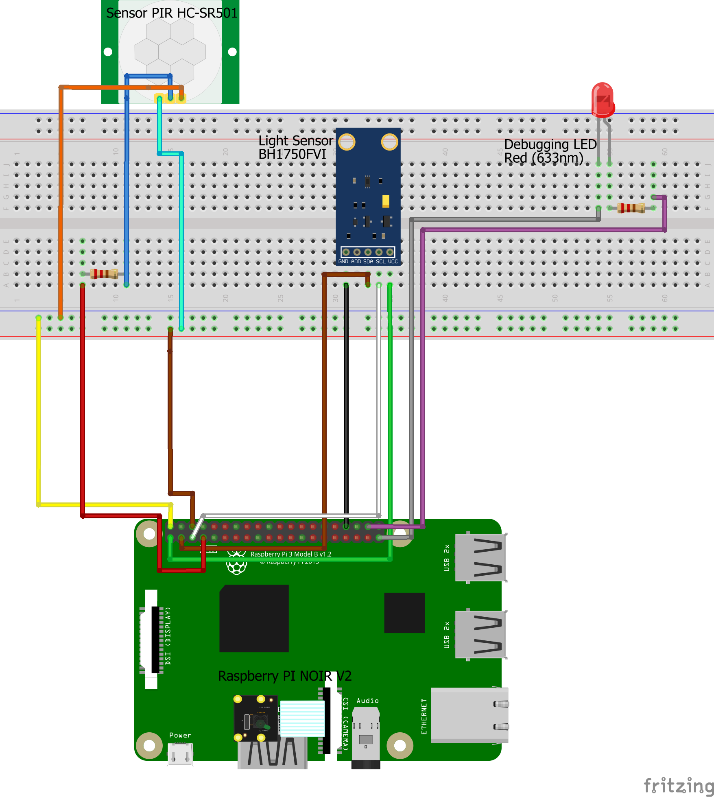

# Home intrusion detector

The idea behind this project is to create the means for a basic security system that can inform the client of a possible intrusion on their property without recording and storing any kind of data locally. We shall connect a camera and a motion sensor to a Raspberry. These sensors will collect data, process it and send it to the client's device. A light intensity sensor might be used aswell. The idea is to have the motion sensor, triggering the camera to turn on and then take a picture of the surroundings. The settings of the camera should be adjusted using the light intensity sensor data which is also collected(day/night).

## Screenshots
![Intruder detector sample demo][demo-gif]  

[(Youtube Video)][demo-yt]

## Schematics

## Requirements:

- [x] Raspberry Pi 
- [x] Motion sensor (HC-SR501)
- [x] Camera (I'm using PI NOIR infrared cam)
- [x] Light intensity sensor (BH1750/BH1750FVI)
- [x] Router capable of sharing LAN and local wireless network(optional-if you want to connect without wiring the raspberry, from your computer)
- [x] Python 3
- [x] PIP3
- [x] Firebase-admin library for python
- [x] Twilio library for python
- [x] 2 resistors (10k,100-150k) [optional]
- [x] 1 debugging led [optional]
- [x] breadboard
- [x] jumper wires

## Output
    Distinguishable picture of the object that is moving within the proximity of the sensors, sent to whatsapp.

## Setup and Build
0. Make sure you have the latest updates on your Debian.
1. Download related libraries using the following commands:
    - `pip3 install firebase-admin`
    - `pip3 install twilio`
2. Create a Firebase project on [Firebase Console](https://console.firebase.google.com)
    - under Project Settings -> Service Accounts -> Firebase Admin SDK -> generate a new json file containing the credentials(private key)
    - modify the name and put it inside the project folder
    - replace its name in `settings.py`
    - modify the storage bucket in `settings.py`
3. Create a Twilio account on [Twilio](https://www.twilio.com/)
    - generate Account SID and Auth Token
    - replace them in `settings.py`
    - go under Programmable Messaging -> Try It Out -> WhatsApp -> follow the instructions to set up your testing sandbox (you need to send a whatsapp message to the number they provide every 24h in order to receive messages from their api within this timeframe)
4. Change the Path to your local photo storage in `settings.py`
5. Given the light intensity in your surroundings, you can set the threshold for day/night using `LIGHT_THRESHOLD` in `settings.py`. Default is 40.0 lumen. Above is daylight, below is night.
6. Modify FROM and TO numbers in `settings.py`. From is the number given by TWILIO and TO is the number where you want to receive the notifications and which you used to set up the sandbox with.

## Running
1. Connect the required components while having your raspberry turned off.
2. Turn on the I2C interface and camera in the settings of your Raspberry PI
3. Run the program with Python3 - `python3 main.py`
4. Allow time for the set up/calibration.
5. Move in front of the camera.
6. Keep the camera still and wait for picture to be taken.
7. Wait for picture to be uploaded and sent to your phone.
8. Voila.

## Future
- [ ] Later implementation could include face detection.  
- [ ] More camera settings based on light.  
- [ ] Since exposure during night time can ruin the quality of the picture, video recording can be added to the program.  
- [ ] Light intensity sensor/Motion sensor can be replaced by camera light/motion detection scripts.(but the point of my project was to have multiple sensors depending on eachother)  
- [ ] Code optimization.  

[demo-gif]: demo.gif
[demo-yt]: https://www.youtube.com/watch?v=ua7tfvQPwSM
